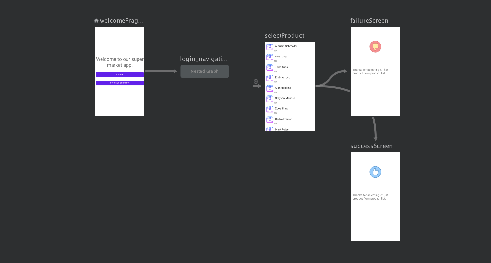

# android-architecture-components-navigation
This is a sample project for "Android Architecture Components Navigation" it explains basic Sample for navigation component.No validation needs to be added on some sccreens like (Login/Register and Forgot passsword screens) as it just explains different features of the navigations.

==============================================

Navigation refers to the interactions that allow users to navigate across, into, and back out from the different pieces of content within your app.

==============================================

### Features

This sample showcases the following features of the Navigation component:

 * Navigating via actions.
 * Transitions.
 * Popping destinations from the back stack(using popUpTo and popUpToInclusive).
 * Arguments (SuccessScreen screen receives a product name).
 * Conditional navigation(On product select either navigate to success or failure screen).
 * Nested graph(Login destinations were grouped into a nested graph).
 * Global actions(Different destinations are navigating to SelectProduct screen so we have created global actioin that navigates to it)
 
 
 ### Screenshots

 ### Screenshots-Nested Graph

